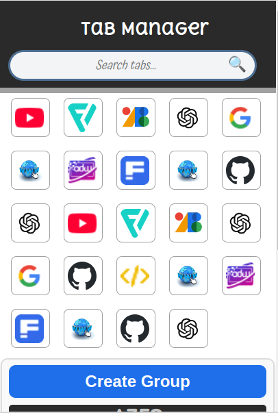

# Tab Manager Extension ✨

Une extension Chrome qui vous permet de gérer facilement vos onglets en créant des groupes, d'ajouter ou supprimer des onglets et de sauvegarder vos groupes pour une gestion simplifiée.

## Fonctionnalités 🚀

Voici une version mise à jour des fonctionnalités avec les ajouts que vous avez mentionnés :

---

### Fonctionnalités 🚀

- **Créer des groupes** 📂 : Organisez vos onglets en différents groupes pour mieux les gérer.
- **Déplacement des onglets** 🔄 : Glissez-déposez les onglets entre les groupes pour une gestion fluide.
- **Suppression de groupes** 🗑️ : Supprimez un groupe d'onglets facilement en un clic.
- **Sauvegarde automatique** 💾 : Les groupes sont sauvegardés localement, vous pouvez revenir à votre configuration même après la fermeture du navigateur.
- **Importer une session** 📥 : Chargez une session sauvegardée pour retrouver rapidement vos groupes et onglets précédents.
- **Exporter une session** 📤 : Sauvegardez vos groupes et onglets dans un fichier pour pouvoir les importer sur un autre appareil ou navigateur.
- **Fermeture des onglets inactifs** ❌ : Les onglets inactifs sont automatiquement fermés après une certaine période d'inactivité pour alléger votre session et améliorer les performances.

---

## Capture d'écran 📸



## Prérequis 📦

Avant de commencer, assurez-vous que vous avez installé :

- **Google Chrome** 🔥
- **Chrome Extensions** activées 🔧

## Installation 🔨

1. Clonez ce dépôt sur votre machine :
   ```bash
   git clone https://github.com/Jeanga7/tab-manager.git
   ```

2. Ouvrez **Chrome** et allez dans la page des extensions :  
   `chrome://extensions/`

3. Activez le mode **Développeur** en haut à droite.

4. Cliquez sur **Charger l'extension décompressée** et sélectionnez le dossier du projet cloné.

5. L'extension est maintenant installée et prête à être utilisée ! 🎉

## Utilisation 🚀

1. Cliquez sur l'icône de l'extension dans la barre d'outils Chrome.
2. Créez un groupe d'onglets en cliquant sur le bouton "Create Group".
3. Organisez vos onglets en les glissant-déposant dans les groupes.
4. Sauvegardez vos groupes pour revenir à votre configuration plus tard.

## Développement 💻

Si vous souhaitez contribuer au projet, voici comment démarrer :

1. Clonez le dépôt :
   ```bash
   git clone https://github.com/Jeanga7/tab-manager.git
   ```

2. Ouvrez le projet dans votre éditeur préféré.

3. Faites vos modifications et tests !

4. Soumettez une **pull request** pour partager vos améliorations ! 🚀

## Contributeurs 🤝

Merci à tous les contributeurs et à ceux qui utilisent et améliorent cette extension ! 🌟

- [Votre Nom](https://github.com/Jeanga7)
  
## Licence 📝

Ce projet est sous la licence MIT - consultez le fichier [LICENSE](./LICENSE) pour plus de détails.

## Remerciements 🙏

Un grand merci à **Chrome Developers** pour la possibilité de créer des extensions et aux développeurs open-source dont le travail rend tout cela possible. ❤️


### Explications des sections :
- **Fonctionnalités** : Résume les principales fonctionnalités du projet.
- **Capture d'écran** : Ajoute une capture d'écran pour donner un aperçu de l'interface utilisateur.
- **Prérequis** : Décrit les prérequis nécessaires à l'installation et à l'exécution de l'extension.
- **Installation** : Donne des instructions détaillées pour installer l'extension sur Chrome.
- **Utilisation** : Explique comment utiliser l'extension après installation.
- **Développement** : Fournit des informations pour les développeurs souhaitant contribuer au projet.
- **Contributeurs** : Liste les personnes qui ont contribué au projet (si applicable).
- **Licence** : Mentionne la licence utilisée (MIT ici).
- **Remerciements** : Exprime la gratitude envers les contributeurs et les développeurs open-source.
